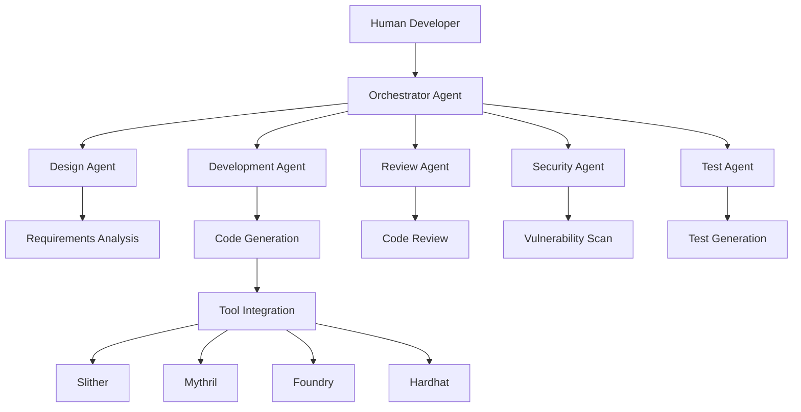

[4 tools called]

## レポート分析: 良いところの抽出

3つのレポートからSolidityスマートコントラクト開発用エージェント構築のベストプラクティスを抽出しました：

### Claudeレポートからの優良点
- **マルチエージェントアーキテクチャ**: 生成、テスト、最適化、セキュリティレビューの専門分担
- **ハイブリッドアプローチ**: QLoRAファインチューニング + RAG + ツール統合
- **構造化ワークフロー**: 研究(40%) + 計画(30%) + 実装(30%)の時間配分
- **セキュリティツール統合**: Slither, Mythril, Echidnaの自動統合
- **文脈管理**: 圧縮・アーカイブ・分離によるコンテキスト管理
- **生産レベル考慮**: CI/CD統合、監査証跡、秘密管理

### GPTレポートからの優良点
- **役割分担エージェント**: プロジェクトマネージャー、アーキテクト、エンジニア、テスターの分担
- **自己改善ループ**: Reflection手法による自己修正
- **コンパイル検証ループ**: 自動コンパイル・テスト・修正サイクル
- **セキュリティ脅威検出**: 脆弱性パターン認識と修正
- **プロンプトガイドライン**: 明確な指示フォーマットとコンテキスト共有
- **人間監視体制**: 最終チェックとフィードバックループ

### Manusレポートからの優良点
- **4つの専門エージェント**: Logic, Security, Testing, Refactoringの明確分担
- **階層的ルール構造**: グローバル→プロジェクト→タスクのルール体系
- **Plan-Code-Review-Test-Refine-Completeのワークフロー**
- **セキュリティ優先**: Checks-Effects-Interactionsパターン等のベストプラクティス
- **テスト駆動開発**: TDDアプローチの組み込み

## Solidityスマートコントラクト開発用エージェント整備計画

### 1. 全体アーキテクチャ: ハイブリッドマルチエージェントシステム

既存AI Agent(Cursor, Amazon Q Developer CLI, Claude Code, Codex)をベースに、**カスタムエージェント群**をオーケストレーションする設計を採用します。



### 2. 専門化エージェントの定義

各エージェントをSolidity開発の特定フェーズに特化させ、**既存ツールとの連携**を前提とします：

#### **Design Agent (設計エージェント)**
- **役割**: 要件分析、コントラクト設計、ガス最適化計画
- **専門知識**: ERC標準、OpenZeppelinパターン、ガス効率設計
- **使用ツール**: Cursorの分析機能、Claude Codeの設計支援
- **出力**: 設計仕様書、コントラクト構造図、ガス見積もり

#### **Development Agent (開発エージェント)**  
- **役割**: Solidityコード生成、関数実装、イベント定義
- **専門知識**: Solidity文法、EVM挙動、ストレージ最適化
- **使用ツール**: Cursorのコード補完、Amazon Qのコード生成
- **出力**: コンパイル可能なSolidityコード、NatSpecドキュメント

#### **Review Agent (レビューエージェント)**
- **役割**: コード品質チェック、ベストプラクティス遵守確認
- **専門知識**: Solidityスタイルガイド、命名規則、コード構造
- **使用ツール**: CursorのLinting、Claude Codeのレビュー機能
- **出力**: レビューコメント、改善提案、リファクタリング計画

#### **Security Agent (セキュリティエージェント)**
- **役割**: 脆弱性検出、セキュリティパターン適用、攻撃ベクトル分析
- **専門知識**: 再入可能性、オーバーフロー、アクセス制御、Oracle操作
- **使用ツール**: Slither, Mythril, Echidnaとの統合
- **出力**: セキュリティレポート、修正パッチ、テストケース

#### **Test Agent (テストエージェント)**
- **役割**: 単体テスト、統合テスト、ファジングテスト生成
- **専門知識**: Foundry/Hardhatテストパターン、プロパティベーステスト
- **使用ツール**: Foundry, Hardhatとの統合
- **出力**: テストスイート、テストレポート、カバレッジ分析

### 3. ルールファイル体系 (.cursorrules, .clauderc, etc.)

階層的ルール構造を採用し、各エージェントに特化したルールファイルを整備：

#### **グローバルルール** (全エージェント共通)
```yaml
# .solidity-agent-global
solidity:
  version: "0.8.20"
  compiler: "solc"
  standards: ["ERC-20", "ERC-721", "ERC-1155"]
  
security:
  patterns: ["Checks-Effects-Interactions", "ReentrancyGuard"]
  tools: ["Slither", "Mythril", "Echidna"]
  
style:
  guide: "official-solidity-style-guide"
  documentation: "NatSpec-required"
```

#### **エージェント別ルール** (各エージェント専用)
```yaml
# .security-agent-rules
vulnerabilities:
  - reentrancy
  - overflow_underflow  
  - access_control
  - oracle_manipulation
  
patterns:
  - "require(msg.sender == owner)"
  - "nonReentrant modifier"
  - "_; (Checks-Effects-Interactions)"
```

### 4. ワークフロー設計 (LangGraphベース)

**Plan → Design → Develop → Review → Test → Security → Refine → Deploy** のワークフローを実装：

```python
# workflow.py (LangGraph implementation)
from langgraph import StateGraph

workflow = StateGraph(SolidityProject)

# Add nodes for each agent
workflow.add_node("design_agent", design_agent)
workflow.add_node("dev_agent", development_agent) 
workflow.add_node("review_agent", review_agent)
workflow.add_node("security_agent", security_agent)
workflow.add_node("test_agent", test_agent)

# Define edges with conditions
workflow.add_edge("design_agent", "dev_agent")
workflow.add_conditional_edges(
    "dev_agent", 
    lambda x: x.status == "completed",
    {"review_agent": "review", "design_agent": "revise"}
)
workflow.add_edge("review_agent", "security_agent")
workflow.add_edge("security_agent", "test_agent")
workflow.add_conditional_edges(
    "test_agent",
    lambda x: x.all_tests_pass,
    {"deploy": END, "dev_agent": "fix_bugs"}
)
```

### 5. Solidity特化モデルの開発

ChainGPTのSolidity LLMを参考に、**QLoRAファインチューニング**を実装：

#### **データセット準備**
- OpenZeppelinコントラクト (10,000+ 件)
- 監査済みDeFiプロトコル (Uniswap, Compound等)
- SWCレジストリの脆弱性事例
- ガス最適化ベンチマーク

#### **ファインチューニング設定**
```python
from peft import LoraConfig
from transformers import TrainingArguments

lora_config = LoraConfig(
    r=256,  # rank
    lora_alpha=512,
    target_modules=["q_proj", "k_proj", "v_proj", "o_proj"],
    lora_dropout=0.05,
    bias="none",
    task_type="CAUSAL_LM"
)

training_args = TrainingArguments(
    output_dir="./solidity-llm",
    num_train_epochs=1,
    per_device_train_batch_size=4,
    gradient_accumulation_steps=8,
    learning_rate=1e-4,
    fp16=True,
    logging_steps=10,
    save_steps=500,
)
```

### 6. 既存ツール統合戦略

#### **Cursor Integration**
- `.cursorrules` ファイルによるエージェント動作制御
- カスタムコマンドパレットでのエージェント起動
- リアルタイムコード分析との連携

#### **Amazon Q Developer CLI**
- `q chat` での設計相談
- `q generate` でのコード生成
- カスタムプロンプトテンプレートの適用

#### **Claude Code**
- 対話型開発支援
- コードレビューモードでのセキュリティチェック
- MCP (Model Context Protocol) 経由のツール統合

### 7. セキュリティ統合と品質保証

#### **自動セキュリティ検証パイプライン**
```bash
# CI/CD pipeline example
solc --version
slither .
mythril analyze --solc-json .
echidna-test .
forge test
```

#### **人間監視ポイント**
- コントラクトデプロイ前の最終レビュー
- 監査会社への提出前チェック
- テストネットデプロイ後の検証

### 8. 実装ロードマップ

#### **Phase 1: PoC (1-2ヶ月)**
- Design Agent + Development Agent の基本実装
- 既存ツールとの連携検証
- シンプルERC-20コントラクトでのテスト

#### **Phase 2: MVP (2-3ヶ月)**  
- 全5エージェントの統合
- ルールファイル体系の完成
- DeFiプロトコルの開発テスト

#### **Phase 3: Production (3-6ヶ月)**
- QLoRAファインチューニングモデルの開発
- CI/CDパイプラインの統合
- 本番監査プロセスとの連携

この計画により、既存AI Agentの強みを活かしつつ、Solidity特有のセキュリティ要件と開発効率を両立したエージェントシステムを実現できます。特に、マルチエージェントアーキテクチャと構造化ワークフローが、単一エージェントでは難しい品質保証と専門分担を実現します。