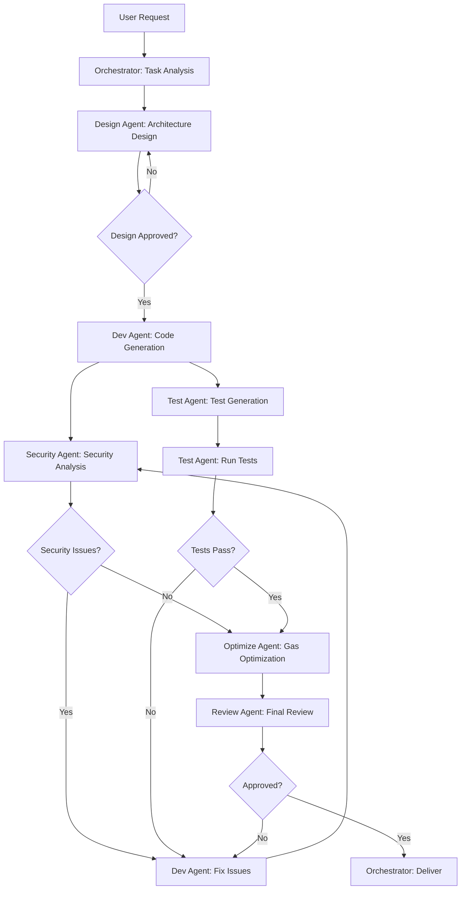

# Solidityスマートコントラクト開発エージェント整備計画

## 1. エグゼクティブサマリー

本計画は、既存AIエージェント（Cursor、Amazon Q Developer CLI、Claude、Codexなど）を活用し、カスタムエージェント、ルールファイル、ワークフローを組み合わせて、Solidityスマートコントラクト開発に特化したエージェントシステムを構築することを目的とします。

**核心戦略**: マルチエージェントアーキテクチャによる役割分担と、段階的な実装アプローチ

## 2. 3つのレポートから抽出した主要知見

### 2.1 GPTレポートの優れた点

#### 2.1.1 マルチステップ・プランニングの重要性
- 要求分析 → 計画 → コード生成 → テスト → 修正の段階的アプローチ
- 単一LLMに複雑な要求を一度に解決させるのではなく、タスクを細分化

#### 2.1.2 役割ごとのLLMエージェント協調
- MetaGPTフレームワークの事例：プロダクトマネージャー、アーキテクト、エンジニア、テスターの役割分担
- LLM-SmartAuditの成功例：プロジェクトマネージャ・コントラクト専門家・セキュリティ監査役の協調

#### 2.1.3 自己評価・自己改善ループ
- Reflection手法：生成途中で「このままでは何が問題か？」と自問
- Self-Iterationアプローチ：分析者、設計者、開発者、テスターの役を順番に演じる

#### 2.1.4 ツール統合の重要性
- コンパイラ、リンタ、静的解析ツール（Slither、Mythril）との統合
- コード実行・テスト環境の提供による自動バグ修正

### 2.2 Manusレポートの優れた点

#### 2.2.1 明確なマルチエージェント設計
| エージェント | 役割 | 専門知識 |
|------------|------|---------|
| Logic Agent | ビジネスロジック実装 | Solidity文法、ERC標準 |
| Security Agent | 脆弱性検出・修正 | 再入可能性、整数オーバーフロー、アクセス制御 |
| Testing Agent | テスト生成・実行 | Foundry/Hardhat、単体/統合テスト |
| Refactoring Agent | 最適化・スタイル適用 | ガス効率、Solidityスタイルガイド |

#### 2.2.2 階層的ルールファイル構造
| ルール種別 | 適用範囲 | 例 |
|----------|---------|---|
| グローバルルール | すべてのタスク | 「世界トップクラスのSolidity開発者」 |
| プロジェクトルール | 特定プロジェクト | 「Solidity 0.8.20使用」 |
| タスクルール | 個別タスク | 「onlyOwner修飾子でアクセス制限」 |

#### 2.2.3 LangGraphによるステートフルワークフロー
1. Plan (計画) → 2. Code (実装) → 3. Review (レビュー) → 4. Test (テスト) → 5. Refine (洗練) → 6. Complete (完了)

#### 2.2.4 ファインチューニング戦略
- LoRA（Low-Rank Adaptation）による効率的な微調整
- セキュリティ監査済みコントラクト、脆弱性とその修正パッチを含むデータセット

### 2.3 Claudeレポートの優れた点

#### 2.3.1 3フェーズワークフローの価値配分
- **研究フェーズ（20%時間）→ 50%価値**：アーキテクチャ、依存関係、セキュリティ考慮事項の理解
- **計画フェーズ（20%時間）→ 30%価値**：詳細な実装計画、セキュリティチェックリスト
- **実装フェーズ（60%時間）→ 20%価値**：計画に基づく系統的な実装

#### 2.3.2 モデル選択の実証データ
- Claude 3.5 Sonnet: 100.5/110（Solidity生成で最高スコア）
- GPT-4o: 86/110
- DeepSeek Coder V2: GPT-4と同等の性能、90%低コスト

#### 2.3.3 具体的なプロンプトエンジニアリング技法
- Chain-of-Thought: 論理エラー40-50%削減
- Few-shot examples: 3-5の多様な事例（SafeMath、アクセス制御）
- システムプロンプト: NatSpec、セキュリティチェック、イベント発行、CEIパターン、ガス最適化

#### 2.3.4 ハイブリッドアプローチの優位性
- ファインチューニング + RAG: 35%精度向上（ファインチューニング単独20%、RAG単独25%）
- ファインチューニング: Solidityイディオムの理解
- RAG: 最新ドキュメント、セキュリティパターン
- ツール呼び出し: 自動検証（コンパイル、分析、テスト）

#### 2.3.5 セキュリティツールの統合実績
- Slither: 76+検出器、99.9%パース精度、1秒未満
- Mythril: シンボリック実行、平均5分
- 組み合わせで80-92%の既知脆弱性を検出

## 3. Solidityエージェントシステム設計

### 3.1 マルチエージェントアーキテクチャ

```
┌─────────────────────────────────────────────────────────┐
│                   Orchestrator Agent                     │
│              (タスク分解・調整・統合)                      │
└─────────────────────────────────────────────────────────┘
                            │
        ┌───────────────────┼───────────────────┐
        ▼                   ▼                   ▼
┌───────────────┐  ┌───────────────┐  ┌───────────────┐
│ Design Agent  │  │ Review Agent  │  │  Test Agent   │
│               │  │               │  │               │
│ ・要件分析     │  │ ・コードレビュー│  │ ・テスト生成  │
│ ・設計計画     │  │ ・セキュリティ  │  │ ・テスト実行  │
│ ・アーキテクチャ│  │   監査         │  │ ・カバレッジ  │
└───────────────┘  └───────────────┘  └───────────────┘
        ▼                   ▼                   ▼
┌───────────────┐  ┌───────────────┐  ┌───────────────┐
│ Dev Agent     │  │Security Agent │  │ Optimize Agent│
│               │  │               │  │               │
│ ・コード生成   │  │ ・脆弱性検出   │  │ ・ガス最適化  │
│ ・ERC標準実装  │  │ ・Slither実行  │  │ ・ストレージ  │
│ ・OpenZeppelin │  │ ・Mythril実行  │  │   パッキング  │
└───────────────┘  └───────────────┘  └───────────────┘
```

### 3.2 各エージェントの詳細仕様

#### 3.2.1 Orchestrator Agent（オーケストレーター）
**役割**: タスク全体の調整、エージェント間の情報伝達、ワークフロー管理

**使用ツール**: Cursor / Claude Code（高度な推論能力）

**システムプロンプト構造**:
```markdown
# Role
あなたはSolidityスマートコントラクト開発プロジェクトの統括責任者です。

# Responsibilities
- ユーザー要求を分析し、適切なエージェントにタスクを委譲
- 各エージェントの成果物を統合
- ワークフローの進行管理
- 最終成果物の品質保証

# Workflow
1. 要求分析 → Design Agentに委譲
2. 設計承認 → Dev Agentに委譲
3. コード生成 → Security Agent & Test Agentに並行委譲
4. 問題検出 → Dev Agentに修正依頼
5. 最適化 → Optimize Agentに委譲
6. 最終レビュー → Review Agentに委譲
```

#### 3.2.2 Design Agent（設計エージェント）
**役割**: 要件分析、アーキテクチャ設計、実装計画策定

**使用ツール**: Claude 3.5 Sonnet（最高の設計能力）

**システムプロンプト構造**:
```markdown
# Role
あなたは経験豊富なスマートコントラクトアーキテクトです。

# Responsibilities
- ユーザー要求を技術仕様に変換
- コントラクト構造の設計（継承、インターフェース、ライブラリ）
- セキュリティ考慮事項の特定
- ガス効率を考慮した設計判断

# Output Format
## 1. 要件サマリー
## 2. コントラクト構造
- MainContract.sol
  - 継承: Ownable, ReentrancyGuard
  - 状態変数: ...
  - 関数: ...
## 3. セキュリティ考慮事項
- 再入可能性リスク: [対策]
- アクセス制御: [対策]
## 4. 実装計画
- Phase 1: ...
- Phase 2: ...
```

**ルールファイル** (`.cursorrules` / `design-agent-rules.md`):
```markdown
# Global Rules
- Solidity 0.8.20以上を使用
- OpenZeppelin Contracts 5.0.0を優先
- すべての設計判断に理由を明記

# Design Principles
- 単一責任の原則（SRP）を適用
- コントラクトサイズ制限（24KB）を考慮
- アップグレード可能性の必要性を評価（Proxy Pattern）
- イベント駆動設計（すべての状態変更でイベント発行）

# Security by Design
- Checks-Effects-Interactions パターンを標準とする
- 外部呼び出しは最小限に
- フォールバック関数の必要性を慎重に評価
```

#### 3.2.3 Dev Agent（開発エージェント）
**役割**: 実際のSolidityコード生成

**使用ツール**: Claude 3.5 Sonnet / DeepSeek Coder V2（コスト重視の場合）

**システムプロンプト構造**:
```markdown
# Role
あなたは世界トップクラスのSolidity開発者です。

# Code Generation Standards
1. NatSpec形式のドキュメント（@title, @notice, @dev, @param, @return）
2. すべての関数にアクセス修飾子（public, external, internal, private）
3. 状態変更関数にはイベント発行
4. Checks-Effects-Interactions パターンの厳守
5. エラーハンドリング（require, revert, custom errors）

# Required Patterns
- アクセス制御: OpenZeppelin Ownable/AccessControl
- 再入可能性防止: ReentrancyGuard
- 整数演算: Solidity 0.8+のビルトインチェック
- トークン標準: OpenZeppelin ERC20/ERC721/ERC1155

# Output Format
```solidity
// SPDX-License-Identifier: MIT
pragma solidity ^0.8.20;

/// @title [Contract Title]
/// @notice [User-facing description]
/// @dev [Developer notes]
contract MyContract {
    // State variables
    
    // Events
    
    // Errors
    
    // Modifiers
    
    // Constructor
    
    // External functions
    
    // Public functions
    
    // Internal functions
    
    // Private functions
}
```
```

**ルールファイル** (`.cursorrules` / `dev-agent-rules.md`):
```markdown
# Solidity Version
- pragma solidity ^0.8.20;

# Imports
- OpenZeppelin: @openzeppelin/contracts@5.0.0
- Chainlink: @chainlink/contracts@1.0.0

# Naming Conventions
- Contracts: PascalCase (MyContract)
- Functions: camelCase (myFunction)
- State variables: camelCase (_privateVar with underscore prefix)
- Constants: UPPER_SNAKE_CASE
- Events: PascalCase (Transfer)
- Errors: PascalCase with Error suffix (InsufficientBalanceError)

# Gas Optimization
- uint256 over smaller uints (unless packing)
- external over public for external-only functions
- calldata over memory for read-only arrays
- Immutable for constructor-set values
- Constant for compile-time values

# Security Checklist
- [ ] Checks-Effects-Interactions pattern
- [ ] ReentrancyGuard on external calls
- [ ] Access control modifiers
- [ ] Input validation (require statements)
- [ ] Event emission for state changes
- [ ] No tx.origin (use msg.sender)
- [ ] No block.timestamp for critical logic
- [ ] SafeERC20 for token transfers
```

#### 3.2.4 Security Agent（セキュリティエージェント）
**役割**: 脆弱性検出、セキュリティ監査、修正提案

**使用ツール**: Claude 3.5 Sonnet（推論能力）+ Slither + Mythril

**システムプロンプト構造**:
```markdown
# Role
あなたはスマートコントラクトセキュリティ監査の専門家です。

# Analysis Approach
1. 静的解析ツール実行（Slither, Mythril）
2. 手動コードレビュー
3. 既知脆弱性パターンのチェック
4. ビジネスロジックの検証

# Vulnerability Checklist
## High Severity
- [ ] Reentrancy (SWC-107)
- [ ] Access Control (SWC-105)
- [ ] Arithmetic Issues (SWC-101)
- [ ] Unchecked Call Return Values (SWC-104)
- [ ] Delegatecall to Untrusted Callee (SWC-112)

## Medium Severity
- [ ] Timestamp Dependence (SWC-116)
- [ ] DoS with Block Gas Limit (SWC-128)
- [ ] Insufficient Gas Griefing (SWC-126)

## Low Severity
- [ ] Floating Pragma (SWC-103)
- [ ] Outdated Compiler Version
- [ ] Missing Events

# Output Format
## Security Analysis Report
### Critical Issues (Blocker)
- Issue: [Description]
- Location: [File:Line]
- Impact: [Explanation]
- Recommendation: [Fix]
- Code Example: [Fixed code]

### High Priority Issues
...

### Recommendations
...
```

**ツール統合スクリプト** (`security-check.sh`):
```bash
#!/bin/bash

echo "=== Running Slither ==="
slither . --json slither-report.json

echo "=== Running Mythril ==="
myth analyze contracts/*.sol --solv 0.8.20 -o json > mythril-report.json

echo "=== Generating Summary ==="
# AI Agentがレポートを解析し、要約を生成
```

#### 3.2.5 Test Agent（テストエージェント）
**役割**: テストコード生成、テスト実行、カバレッジ測定

**使用ツール**: Claude 3.5 Sonnet + Foundry

**システムプロンプト構造**:
```markdown
# Role
あなたはスマートコントラクトのテスト専門家です。

# Test Strategy
1. Unit Tests: 各関数の個別テスト
2. Integration Tests: コントラクト間の相互作用
3. Fuzz Tests: ランダム入力でのプロパティ検証
4. Invariant Tests: システム全体の不変条件

# Test Coverage Requirements
- Line Coverage: >95%
- Branch Coverage: >90%
- Function Coverage: 100%

# Output Format (Foundry)
```solidity
// SPDX-License-Identifier: MIT
pragma solidity ^0.8.20;

import "forge-std/Test.sol";
import "../src/MyContract.sol";

contract MyContractTest is Test {
    MyContract public myContract;
    
    function setUp() public {
        myContract = new MyContract();
    }
    
    function test_FunctionName_Scenario() public {
        // Arrange
        
        // Act
        
        // Assert
    }
    
    function testFuzz_FunctionName(uint256 amount) public {
        // Assumptions
        vm.assume(amount > 0 && amount < type(uint256).max);
        
        // Test
    }
    
    function invariant_PropertyName() public {
        // Invariant assertion
    }
}
```
```

**ルールファイル** (`test-agent-rules.md`):
```markdown
# Test Framework
- Foundry (forge test)

# Test Naming Convention
- test_FunctionName_Scenario() for unit tests
- testFuzz_FunctionName() for fuzz tests
- invariant_PropertyName() for invariant tests
- testFail_FunctionName_ErrorCase() for expected failures

# Test Structure (AAA Pattern)
1. Arrange: Setup test conditions
2. Act: Execute the function
3. Assert: Verify the outcome

# Foundry Cheatcodes
- vm.prank(address): Set msg.sender for next call
- vm.expectRevert(): Expect next call to revert
- vm.expectEmit(): Expect event emission
- vm.warp(timestamp): Set block.timestamp
- vm.roll(blockNumber): Set block.number

# Coverage Command
forge coverage --report lcov
```

#### 3.2.6 Review Agent（レビューエージェント）
**役割**: コード品質レビュー、ベストプラクティス確認

**使用ツール**: Claude 3.5 Sonnet

**システムプロンプト構造**:
```markdown
# Role
あなたは経験豊富なコードレビュアーです。

# Review Checklist
## Code Quality
- [ ] 可読性（命名、コメント、構造）
- [ ] DRY原則（重複コードの排除）
- [ ] SOLID原則の適用
- [ ] エラーメッセージの明確性

## Solidity Best Practices
- [ ] NatSpec完全性
- [ ] イベント発行の適切性
- [ ] 修飾子の適切な使用
- [ ] ライブラリの適切な活用

## Gas Efficiency
- [ ] 不要なストレージ操作
- [ ] ループの最適化
- [ ] 変数パッキング
- [ ] 定数・immutableの活用

# Output Format
## Code Review Summary
### Strengths
- [Positive points]

### Issues Found
#### Critical
- [Issue with location and fix]

#### Suggestions
- [Improvement suggestions]

### Overall Assessment
- Quality Score: X/10
- Recommendation: [Approve/Request Changes]
```

#### 3.2.7 Optimize Agent（最適化エージェント）
**役割**: ガス最適化、ストレージ最適化

**使用ツール**: Claude 3.5 Sonnet + Foundry Gas Reporter

**システムプロンプト構造**:
```markdown
# Role
あなたはガス最適化の専門家です。

# Optimization Strategies
1. Storage Optimization
   - Variable packing (uint128 + uint128 = 1 slot)
   - Use mappings over arrays when possible
   - Delete unused storage variables

2. Computation Optimization
   - Cache storage variables in memory
   - Use unchecked for safe arithmetic
   - Short-circuit boolean operations

3. Function Optimization
   - external over public
   - calldata over memory
   - Batch operations

# Gas Measurement
- Use forge snapshot for gas benchmarking
- Compare before/after optimization

# Output Format
## Optimization Report
### Current Gas Usage
- Function X: Y gas

### Proposed Optimizations
1. [Optimization description]
   - Expected savings: Z gas (W%)
   - Code change: [diff]

### Total Estimated Savings
- Before: X gas
- After: Y gas
- Savings: Z gas (W%)
```

### 3.3 ワークフロー設計

#### 3.3.1 標準開発ワークフロー



#### 3.3.2 フェーズ別時間配分（Claudeレポートの知見）

| フェーズ | 時間配分 | 価値配分 | 担当エージェント |
|---------|---------|---------|----------------|
| 研究・分析 | 20% | 50% | Design Agent |
| 計画・設計 | 20% | 30% | Design Agent |
| 実装 | 40% | 15% | Dev Agent |
| テスト・検証 | 15% | 4% | Test Agent, Security Agent |
| 最適化・レビュー | 5% | 1% | Optimize Agent, Review Agent |

### 3.4 ルールファイル階層構造

```
.cursorrules/
├── global/
│   ├── solidity-standards.md       # Solidity全般の標準
│   ├── security-principles.md      # セキュリティ原則
│   └── gas-optimization.md         # ガス最適化ガイド
├── project/
│   ├── project-config.md           # プロジェクト固有設定
│   ├── dependencies.md             # 使用ライブラリ・バージョン
│   └── architecture.md             # アーキテクチャドキュメント
├── agents/
│   ├── orchestrator-rules.md
│   ├── design-agent-rules.md
│   ├── dev-agent-rules.md
│   ├── security-agent-rules.md
│   ├── test-agent-rules.md
│   ├── review-agent-rules.md
│   └── optimize-agent-rules.md
└── tasks/
    ├── erc20-token.md              # ERC20トークン開発タスク
    ├── nft-contract.md             # NFTコントラクト開発タスク
    └── defi-protocol.md            # DeFiプロトコル開発タスク
```

## 4. 実装ロードマップ

### Phase 1: 基盤構築（1-2ヶ月）

#### 4.1.1 ルールファイル整備
- [ ] グローバルルールファイル作成
  - `solidity-standards.md`
  - `security-principles.md`
  - `gas-optimization.md`
- [ ] エージェント別ルールファイル作成
  - 各エージェントのシステムプロンプト
  - 役割定義、責任範囲、出力フォーマット

#### 4.1.2 ツール統合
- [ ] Foundry環境構築
  - `forge init`
  - `foundry.toml` 設定
- [ ] セキュリティツール統合
  - Slither インストール・設定
  - Mythril インストール・設定
  - 自動実行スクリプト作成

#### 4.1.3 プロンプトテンプレート作成
- [ ] 各エージェント用プロンプトテンプレート
- [ ] Few-shot examples 収集（3-5例/エージェント）
- [ ] Chain-of-Thought プロンプトパターン

### Phase 2: 単一エージェント検証（2-3ヶ月）

#### 4.2.1 Dev Agent プロトタイプ
- [ ] 簡単なERC20トークン生成テスト
- [ ] OpenZeppelin統合テスト
- [ ] コンパイル成功率測定

#### 4.2.2 Security Agent プロトタイプ
- [ ] Slither出力解析テスト
- [ ] 既知脆弱性検出テスト
- [ ] 偽陽性フィルタリング

#### 4.2.3 Test Agent プロトタイプ
- [ ] Foundryテスト生成テスト
- [ ] カバレッジ測定
- [ ] Fuzzテスト生成

### Phase 3: マルチエージェント統合（3-4ヶ月）

#### 4.3.1 Orchestrator実装
- [ ] タスク分解ロジック
- [ ] エージェント間通信プロトコル
- [ ] 状態管理（LangGraph or 独自実装）

#### 4.3.2 ワークフロー自動化
- [ ] 標準開発ワークフロー実装
- [ ] エラーハンドリング・リトライロジック
- [ ] 人間承認ポイントの設定

#### 4.3.3 統合テスト
- [ ] ERC20トークン完全開発テスト
- [ ] ERC721 NFT完全開発テスト
- [ ] 簡単なDeFiプロトコル開発テスト

### Phase 4: 高度化・最適化（4-6ヶ月）

#### 4.4.1 RAG統合
- [ ] Solidityドキュメント埋め込み
- [ ] OpenZeppelinコード埋め込み
- [ ] セキュリティベストプラクティス埋め込み
- [ ] ベクトルDB構築（Pinecone / Chroma）

#### 4.4.2 ファインチューニング（オプション）
- [ ] データセット収集（1,000-5,000例）
  - 監査済みコントラクト
  - 脆弱性修正パッチ
  - ガス最適化事例
- [ ] QLoRA設定（r=256, α=512）
- [ ] DeepSeek Coder V2ベースでファインチューニング

#### 4.4.3 モニタリング・評価
- [ ] 成功率測定（コンパイル成功率、テスト合格率）
- [ ] セキュリティ検出率測定
- [ ] ガス効率測定
- [ ] コスト測定（API呼び出し費用）

### Phase 5: 本番運用（6ヶ月以降）

#### 4.5.1 CI/CD統合
- [ ] GitHub Actions統合
- [ ] 自動セキュリティチェック
- [ ] 自動テスト実行
- [ ] デプロイメントゲート

#### 4.5.2 継続的改善
- [ ] フィードバックループ構築
- [ ] ルールファイル更新プロセス
- [ ] プロンプト改善プロセス
- [ ] 新しいセキュリティパターンの追加

## 5. 技術スタック

### 5.1 AIモデル選択

| 用途 | 第1選択 | 第2選択 | 理由 |
|-----|---------|---------|------|
| Orchestrator | Claude 3.5 Sonnet | GPT-4o | 高度な推論能力 |
| Design Agent | Claude 3.5 Sonnet | o1-preview | 設計能力（100.5/110） |
| Dev Agent | Claude 3.5 Sonnet | DeepSeek Coder V2 | Solidity生成最高スコア |
| Security Agent | Claude 3.5 Sonnet | o1 | セキュリティ推論 |
| Test Agent | Claude 3.5 Sonnet | GPT-4o | テスト生成能力 |
| Review Agent | Claude 3.5 Sonnet | GPT-4o | レビュー能力 |
| Optimize Agent | Claude 3.5 Sonnet | DeepSeek Coder V2 | ガス最適化理解 |

**コスト最適化戦略**:
- プロトタイピング: Claude Haiku（$0.25/MTok input）
- 本番ロジック: Claude 3.5 Sonnet（$3/MTok input）
- 大量処理: DeepSeek V3.2（$0.28/MTok input、90%安い）

### 5.2 開発ツール

#### 5.2.1 スマートコントラクト開発
- **Foundry**: テスト・デプロイメントフレームワーク
- **Hardhat**: 代替フレームワーク（必要に応じて）
- **OpenZeppelin Contracts**: 標準ライブラリ

#### 5.2.2 セキュリティツール
- **Slither**: 静的解析（76+検出器、1秒未満）
- **Mythril**: シンボリック実行（5分平均）
- **Echidna**: Fuzzテスト
- **Manticore**: シンボリック実行（高度な分析）

#### 5.2.3 AIエージェントフレームワーク
- **LangChain**: エージェント基盤
- **LangGraph**: ステートフルワークフロー
- **Cursor API**: エディタ統合
- **Amazon Q Developer CLI**: CLI統合（オプション）

#### 5.2.4 RAG構築
- **Vector DB**: Pinecone / Chroma / Weaviate
- **Embedding**: text-embedding-ada-002 / CodeBERT
- **Chunking**: 関数レベル（AST解析）

### 5.3 インフラストラクチャ

#### 5.3.1 開発環境
- **エディタ**: Cursor（AI統合）
- **バージョン管理**: Git + GitHub
- **CI/CD**: GitHub Actions

#### 5.3.2 テスト環境
- **ローカルノード**: Anvil（Foundry）
- **テストネット**: Sepolia, Goerli
- **フォークテスト**: Mainnet fork

#### 5.3.3 モニタリング
- **ログ**: OpenTelemetry
- **メトリクス**: Prometheus + Grafana
- **トレーシング**: Jaeger

## 6. 成功指標（KPI）

### 6.1 品質指標

| 指標 | 目標値 | 測定方法 |
|-----|--------|---------|
| コンパイル成功率 | >95% | 初回生成でのコンパイル成功 |
| テスト合格率 | >90% | 生成テストの合格率 |
| セキュリティ検出率 | >80% | 既知脆弱性の検出率 |
| コードカバレッジ | >95% | Foundry coverage |
| ガス効率 | ベースライン+10% | 手動実装との比較 |

### 6.2 効率指標

| 指標 | 目標値 | 測定方法 |
|-----|--------|---------|
| 開発時間短縮 | 50-70% | 手動開発との比較 |
| 監査準備時間短縮 | 40% | 監査前修正時間 |
| イテレーション速度 | 3分以内 | 要求→デプロイ可能コード |

### 6.3 コスト指標

| 指標 | 目標値 | 測定方法 |
|-----|--------|---------|
| API呼び出しコスト | <$5/コントラクト | Claude API費用 |
| 監査コスト削減 | 40% | 事前検出による削減 |
| 総開発コスト | 60%削減 | 人件費+ツールコスト |

## 7. リスク管理

### 7.1 技術リスク

| リスク | 影響度 | 対策 |
|-------|--------|------|
| AI生成コードの脆弱性 | 高 | 必須の人間監査、複数ツール検証 |
| 偽陽性の多発 | 中 | AI駆動フィルタリング、学習ループ |
| コンテキスト制限 | 中 | RAG、圧縮技術、段階的処理 |
| モデルの幻覚 | 高 | Few-shot examples、検証ループ |

### 7.2 運用リスク

| リスク | 影響度 | 対策 |
|-------|--------|------|
| APIコスト超過 | 中 | キャッシング、モデルカスケーディング |
| レスポンス遅延 | 低 | 並列処理、非同期実行 |
| 依存ツールの障害 | 中 | フォールバック、冗長化 |

### 7.3 セキュリティリスク

| リスク | 影響度 | 対策 |
|-------|--------|------|
| 秘密鍵の漏洩 | 高 | 環境変数、Vault、LLMコンテキスト外 |
| 悪意あるコード生成 | 高 | サンドボックス実行、静的解析 |
| 監査の省略 | 高 | 必須ゲート、プロセス強制 |

## 8. ベストプラクティス

### 8.1 開発プロセス

1. **必ず人間レビューを実施**
   - AI生成コードは必ず専門家がレビュー
   - 特にセキュリティクリティカルな部分

2. **段階的デプロイメント**
   - テストネット → 限定的メインネット → フルデプロイ
   - TVL制限の段階的解除

3. **包括的テスト**
   - 単体テスト、統合テスト、Fuzzテスト、不変条件テスト
   - >95%カバレッジ

4. **複数ツールでの検証**
   - Slither + Mythril + Echidna
   - 偽陽性フィルタリング

5. **専門監査の実施**
   - AI生成でも必ず専門監査
   - Trail of Bits、OpenZeppelin、Consensys Diligence等

### 8.2 プロンプトエンジニアリング

1. **Chain-of-Thought活用**
   ```
   Let's think step by step:
   1. Define the state variable for tracking
   2. Create a modifier that checks and updates status
   3. Apply CEI pattern
   [Generated code follows]
   ```

2. **Few-shot Examples提供**
   - 3-5の多様な事例
   - セキュリティパターン、ガス最適化、エッジケース

3. **明確な制約指定**
   ```
   Create ERC-721 NFT in Solidity 0.8.20 using OpenZeppelin 5.0.0
   with on-chain royalties (ERC-2981), upgradeable proxy (UUPS),
   whitelist minting via Merkle trees
   ```

4. **システムプロンプトの構造化**
   - Role → Responsibilities → Standards → Output Format

### 8.3 コンテキスト管理

1. **Write Context**: `.cursorrules`ファイルで標準化
2. **Select Context**: RAGで関連コード取得
3. **Compress Context**: 要約、スライディングウィンドウ
4. **Isolate Context**: エージェント分離

## 9. 参考資料

### 9.1 Solidityリソース
- [Solidity Documentation](https://docs.soliditylang.org/)
- [OpenZeppelin Contracts](https://docs.openzeppelin.com/contracts/)
- [Ethereum Smart Contract Best Practices](https://consensys.github.io/smart-contract-best-practices/)
- [SWC Registry](https://swcregistry.io/)

### 9.2 セキュリティツール
- [Slither](https://github.com/crytic/slither)
- [Mythril](https://github.com/ConsenSys/mythril)
- [Echidna](https://github.com/crytic/echidna)
- [Foundry](https://book.getfoundry.sh/)

### 9.3 AIエージェントフレームワーク
- [LangChain](https://python.langchain.com/)
- [LangGraph](https://langchain-ai.github.io/langgraph/)
- [Anthropic Claude](https://www.anthropic.com/claude)
- [DeepSeek Coder](https://github.com/deepseek-ai/DeepSeek-Coder)

### 9.4 研究論文・レポート
- ChainGPT Solidity LLM
- Trail of Bits CompChomper Benchmark
- SmartLLM: Fine-tuning for Smart Contract Security
- LLM-SmartAudit: Multi-Agent Security Analysis

## 10. 次のアクションアイテム

### 10.1 即座に開始可能（Week 1-2）
- [ ] グローバルルールファイル作成（`solidity-standards.md`等）
- [ ] Dev Agentプロンプトテンプレート作成
- [ ] Foundry環境構築
- [ ] 簡単なERC20生成テスト

### 10.2 短期目標（Month 1）
- [ ] 全エージェントのプロンプトテンプレート完成
- [ ] Slither/Mythril統合スクリプト作成
- [ ] 単一エージェント検証（Dev, Security, Test）

### 10.3 中期目標（Month 2-3）
- [ ] Orchestrator実装
- [ ] マルチエージェントワークフロー構築
- [ ] ERC20/ERC721完全開発テスト

### 10.4 長期目標（Month 4-6）
- [ ] RAG統合
- [ ] ファインチューニング（オプション）
- [ ] CI/CD統合
- [ ] 本番プロジェクトでの試験運用

---

## 付録A: エージェント間通信プロトコル

### A.1 メッセージフォーマット

```json
{
  "from": "orchestrator",
  "to": "design_agent",
  "task_id": "task-001",
  "task_type": "design",
  "payload": {
    "user_request": "Create an ERC20 token with vesting",
    "context": {
      "project_name": "MyToken",
      "solidity_version": "0.8.20",
      "dependencies": ["@openzeppelin/contracts@5.0.0"]
    }
  },
  "timestamp": "2025-11-01T10:00:00Z"
}
```

### A.2 レスポンスフォーマット

```json
{
  "from": "design_agent",
  "to": "orchestrator",
  "task_id": "task-001",
  "status": "completed",
  "result": {
    "design_document": "...",
    "contract_structure": {...},
    "security_considerations": [...]
  },
  "next_steps": ["dev_agent"],
  "timestamp": "2025-11-01T10:05:00Z"
}
```

## 付録B: セキュリティチェックリスト

### B.1 Critical（ブロッカー）
- [ ] Reentrancy攻撃対策（ReentrancyGuard、CEIパターン）
- [ ] アクセス制御（onlyOwner、require(msg.sender)）
- [ ] 整数演算（Solidity 0.8+、SafeMath）
- [ ] 外部呼び出し戻り値チェック
- [ ] Delegatecall使用の妥当性

### B.2 High
- [ ] tx.origin使用禁止（msg.sender使用）
- [ ] block.timestampの慎重な使用
- [ ] DoS攻撃対策（ガスリミット考慮）
- [ ] フロントランニング対策

### B.3 Medium
- [ ] イベント発行の完全性
- [ ] エラーメッセージの明確性
- [ ] 初期化関数の保護
- [ ] アップグレード可能性の適切な実装

### B.4 Low
- [ ] Floating pragma回避（固定バージョン）
- [ ] 最新コンパイラバージョン使用
- [ ] 未使用変数・関数の削除
- [ ] NatSpecドキュメントの完全性

## 付録C: ガス最適化チェックリスト

### C.1 Storage最適化
- [ ] 変数パッキング（uint128 + uint128 = 1 slot）
- [ ] Constant/Immutable活用
- [ ] 不要なストレージ削除（delete）
- [ ] Mapping vs Array選択

### C.2 Computation最適化
- [ ] ストレージ変数のメモリキャッシング
- [ ] Unchecked使用（安全な場合）
- [ ] 短絡評価の活用
- [ ] ループ最適化

### C.3 Function最適化
- [ ] External vs Public選択
- [ ] Calldata vs Memory選択
- [ ] バッチ操作の実装
- [ ] View/Pure関数の適切な使用

---

**文書バージョン**: 1.0  
**作成日**: 2025-11-01  
**最終更新**: 2025-11-01  
**次回レビュー**: Phase 1完了時

